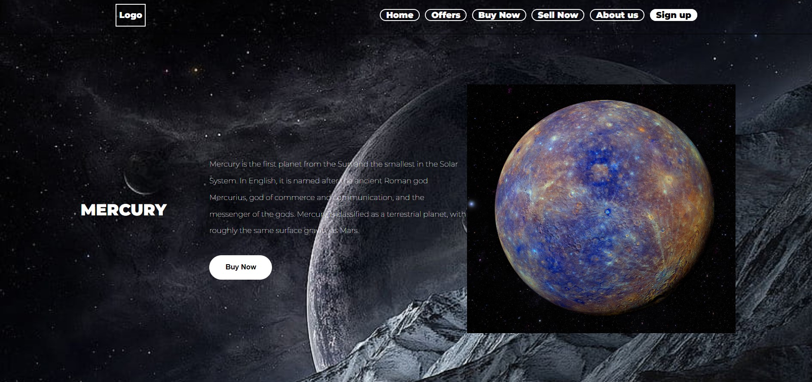

# Planet-Mart
<h1 align="center" id="title">Planet Mart</h1>

Hello Everyone It's my first project in the full-stack development journey. The project comprises of Solar Planets shopping site called Planet Mart. It is developed using HTML and CSS.

<h2>Project Screenshots:</h2>

